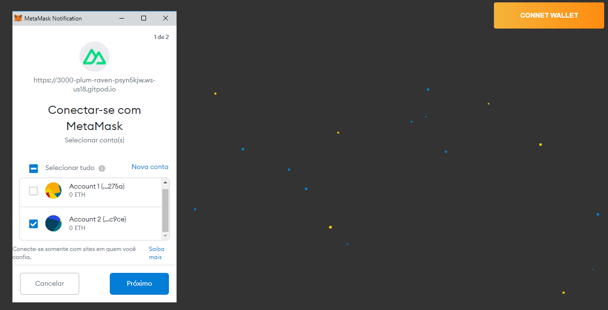

 [](https://gitpod.io#https://github.com/gilberto-009199/Login-Cripto-Wallet-Vue)
 
# Login metamask e trustwallet




  Implementing authentication with noce , using ethers and vue:

+ [plugins/ethers.js](./plugins/ethers.js) - ethers.js proxy plugin code
+ [layouts/default.vue](./layouts/default.vue) - "Connect Wallet" button code
+ [pages/index.vue](./pages/index.vue) - Authentication code by name (Get the ``accounts-change`` emit)

## How does authentication by nonce work?

 Here are the basic steps for authentication using the wallet:

  1° Connecting to the Ethereum Network
   + [Button Wallet](./layouts/default.vue#39) - Set providers

    ```javascript
        // MetaMask
        if (window.ethereum) {
            this.$Web3.setProvider(window.ethereum);
        // Dapp para browsers Legacy...
        } else if (window.web3) {
            this.$Web3.setProvider(web3.currentProvider);
        // Not wallet
        } else {

        }
    ```
   + [Get accounts](./layouts/default.vue#52) - Get accounts Wallet's

    ```javascript
        this.acconts = await this.$Web3.getProvider().send("eth_requestAccounts")
    ```

  2° Generation of Nonce:

   + [NONCE Generate](./pages/index.vue#18) - Generate nonce in backend! Not use fixed!

    ```javascript
        // use a random one coming from your backend!
        let nonce_fixed = 'h34234823j4iuh23r432ihjgyfudhr3843jnuidyhr98734uh';
    ```

    On the server or service performing the authentication, you need to verify the signature to ensure the authenticity of the data. Then, you must save in one of your tables:
        + wallet address
        + original nonce
        + signed nonce
    It is important that you change the nonce at each login (security issue)

  3° Nonce Signature:

   + [NONCE Signature](./pages/index.vue#19) - Signed nonce

    ```javascript
        let nonce = this.$Web3.toHash(nonce_fixed);
        console.log("NONCE: ",nonce);
        this.$Web3.getSigner().signMessage(nonce).then(signed_nonce_front_end=>{
            console.log("signNonce: ", signed_nonce_front_end)
        });

    ```
  4° Signature Verification:
    
   On the server or service performing the authentication, you need to verify the signature to ensure the authenticity of the data:

    ```javascript

        const { ethers } = require('ethers');

        function verifySigned( signed_nonce_front_end , address ) {

        //  ...... search addresss in db, get signed nonce
            const signed_nonce_db = repository.find({ "address": address  }).first();
            
            const isAuth = signed_nonce_front_end.toLowerCase() === signed_nonce_db.toLowerCase();

            return isAuth;
        }
    ```


  

  